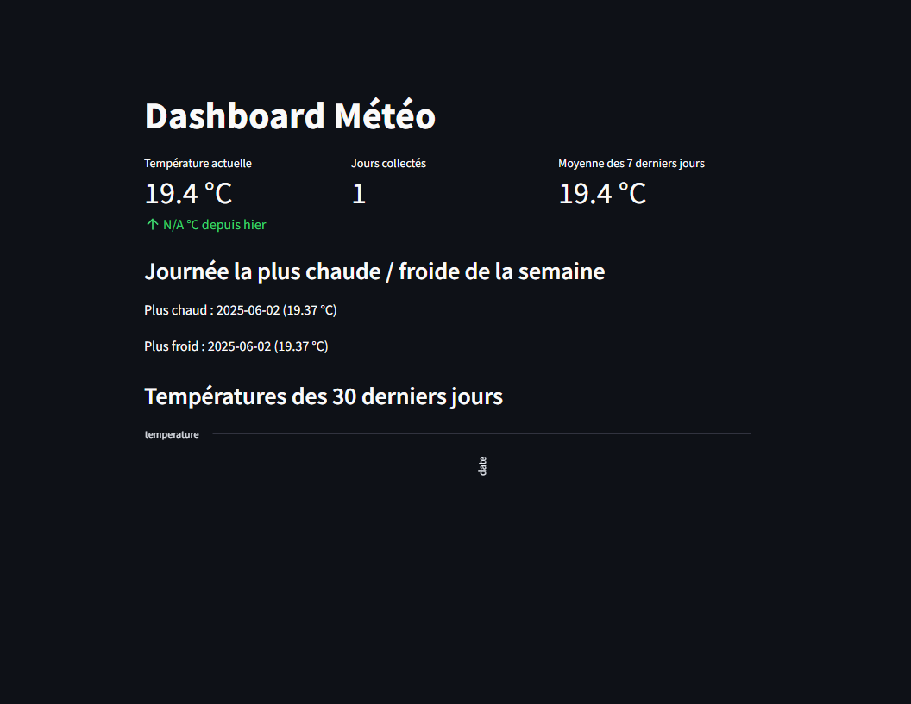

# 🌤️ Dashboard Météo – Pipeline de Données avec Docker, MySQL & Streamlit

Ce projet est un mini pipeline de data engineering qui collecte automatiquement les données météorologiques de la ville de **Paris** via l'API **OpenWeatherMap**, les stocke dans une base **MySQL** conteneurisée, et les visualise dans une application **Streamlit**.

---

## 📌 Fonctionnalités

- Récupération quotidienne des données météo (température, humidité, vent…)
- Insertion dans une base MySQL via un script Python
- Dashboard Streamlit avec :
  - Température actuelle vs hier
  - Moyenne sur 7 jours
  - Jours les plus chauds / froids
  - Graphique des 30 derniers jours
- Exécution dans Docker (MySQL + Streamlit)
- Prêt à être automatisé via cron ou script `.bat`

---

## 🧱 Architecture du projet

```
pipeline-meteo-paris/
├── app/
│   ├── __init__.py
│   ├── config.py
│   ├── fetch_api.py
│   ├── database.py
│   ├── queries.py
│   └── dashboard.py
├── main.py
├── Dockerfile
├── docker-compose.yml
├── requirements.txt
├── screenshots/
│   └── Dashboard.png
└── README.md
```

---

## ⚙️ Installation (via Docker)

### 🔸 1. Prérequis

- Docker Desktop avec WSL2 activé
- Un compte [OpenWeatherMap](https://openweathermap.org/) et une clé API
- Clé insérée dans `fetch_api.py` dans l'URL :  
  `https://api.openweathermap.org/data/2.5/weather?q=Paris&appid=VOTRE_CLÉ_API&units=metric`

---

### 🔸 2. Lancer le projet

```bash
docker-compose up --build
```

Dans un autre terminal :

```bash
docker exec -it meteo_streamlit python main.py
```

---

### 🔸 3. Accéder au dashboard

http://localhost:8501

---

### 🔸 4. Vérifier la base MySQL (optionnel)

```bash
docker exec -it meteo_mysql mysql -uroot -proot
```

```sql
USE meteo_db;
SELECT * FROM meteo;
```

---

## 📸 Capture du Dashboard



---

## 📌 Technologies utilisées

| Élément         | Outil utilisé              |
| --------------- | -------------------------- |
| API Météo       | OpenWeatherMap             |
| Base de données | MySQL (via Docker)         |
| Backend         | Python (requests, pymysql) |
| Visualisation   | Streamlit                  |
| Orchestration   | Docker & Docker Compose    |

---

## 👨‍💻 Auteur

Projet développé par **Mohamed Benasr** (2025) – dans le cadre d'un apprentissage du data engineering, du déploiement avec Docker, et de la visualisation de données temps réel.

---

## ⚠️ Disclaimer

Ce projet a été développé dans un temps limité et présente certaines limitations à noter :

- La qualité et la fiabilité des données peuvent varier selon la disponibilité de l'API OpenWeatherMap
- La gestion des erreurs et la validation des données pourraient être améliorées
- Le système de stockage des données pourrait être optimisé pour une meilleure performance
- La gestion des connexions à la base de données pourrait être plus robuste

Ces points sont identifiés comme des axes d'amélioration pour les futures versions du projet.
